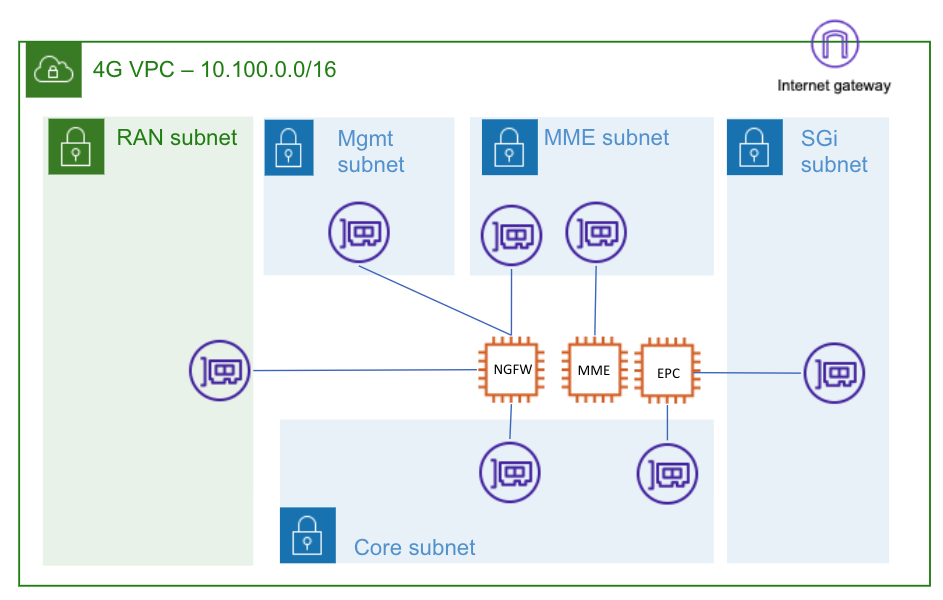

# aws-open5gs-ngfw-s1
This repository contains terraform templates to deploy an AWS VPC with five subnets and four VMs, one of which 
is a Palo Alto Networks NGFW residing on the 4G S1 and S11 interfaces.  Three Ubuntu VMs are
deployed in the "private" subnet to support the open5GS packet, which has 4G NFs enabled.  The steps
to configure the open5GS core are included [here](open5gs_epc_install.md).

The Palo Alto Networks VM is [boostrapped](https://docs.paloaltonetworks.com/vm-series/10-2/vm-series-deployment/bootstrap-the-vm-series-firewall/bootstrap-the-vm-series-firewall-in-aws) 
(using Palo Alto Networks terraform modules) so that it spins up fully configured with appropriate zones, network interface, 
policies, profiles, etc.

NOTE: These templates do not create redundant NGFWs or packet core elements.  For a production grade architecutre multiple Availability Zones and 
NGFWs should be used, as show in the Palo Alto Networks [AWS Reference Architecture Guide](https://www.paloaltonetworks.com/resources/guides/intelligent-architectures-aws-reference-architecture)

Five subnets are created by terraform.

| Subnet | CIDR  |
|   :---: |   :---:      |
| MGMT  | 10.100.0.0/24  |
| RAN  | 10.100.1.0/24  |
| MME  | 10.100.2.0/24  |
| CORE  | 10.100.3.0/24  |
| SGI  | 10.100.4.0/24  |

## Deployment Steps

1. Download this repo

    `git clone https://github.com/mitch-pan/aws-open5gs-ngfw-s1.git`
2. View / modify variables

    Go through the `terraform.tfvars` file to ensure you are happy with the Region, VPC name, subet names, etc.  If you 
    aren't sure, just leave them as is. By default it will deploy to `us-west-1`.
3. Run through terraform commands

    `terraform init`
    
    `terraform plan`
    
    Make sure it all looks good, the region is right, the VPC name is right, etc.  When it all looks ok, apply the changes.
    
    `terraform apply`
 
4. Connect to Ubuntu Instances

    When the terraform templates have been run, there will be several outputs at the end indicating how
    to connect to the the Bastion host and the NGFW.  From here you should read the [open5gs_epc_install](open5gs_epc_install.md) 
    README for the remainder of the setup steps.