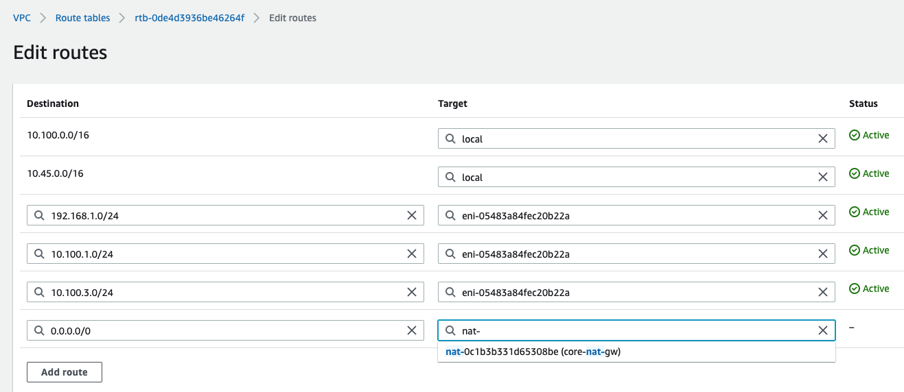
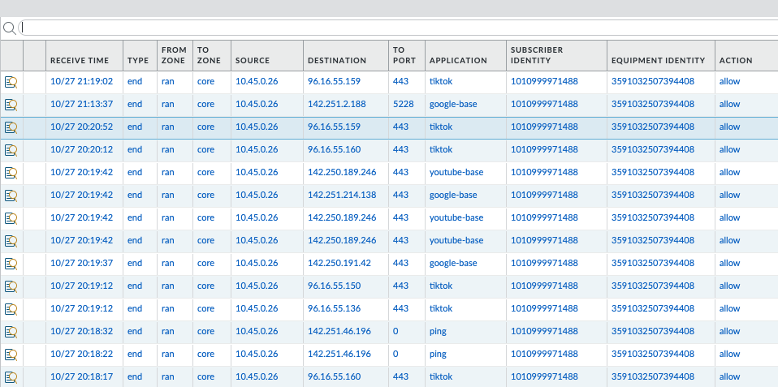
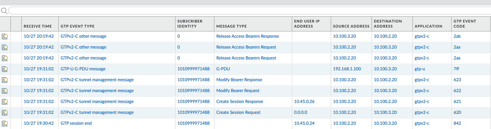

# Open5GS 4G Core Installation Steps

## Introduction

This lab will walk you through the steps of turning up a 4G open5Gs packet core.  Before executing the steps below
ensure you have completed the steps in the [README](README.md)  for this repo. 

There will be four VMs involved in this lab:

1. The NGFW securing the S1 and S11 traffic 
2. The open5Gs 4G packet core, excluding the MME and HSS
3. The open5Gs MME and HSS
4. The Bastion host we use to access the open5Gs VMs

Most of the work to deploy the IaaS and NGFW is done by terraform templates located here.

Once terraform has run successfully, you may proceed with the steps below.


## Installing open5Gs

You can deploy the open5Gs core by building from source, or from using apt.  Since apt is much easier, that is the route this tutorial takes.

There are three hosts discussed below.  Details are captures in this table.


<table>
  <tr>
   <td>VM Nomenclature
   </td>
   <td>Description
   </td>
   <td>IP Address
   </td>
  </tr>
  <tr>
   <td>Ubuntu-EPC
   </td>
   <td>This VM is the VM running the open5Gs packet core, excluding the MME
   </td>
   <td>
   S1-U: 10.100.3.20<br>
   Sgi: 10.100.4.20
   </td>
  </tr>
  <tr>
   <td>Ubuntu-MME
   </td>
   <td>This is the VM running the open5Gs MME and HSS
   </td>
   <td>10.100.2.20
   </td>
  </tr>
  <tr>
   <td>Ubuntu-Bastion
   </td>
   <td>This is the VM running the Basion host
   </td>
   <td>10.100.2.22
   </td>
  </tr>
</table>


### Connecting to the Ubuntu VMs

The NGFW that was deployed using the terraform templates above boostraps with a configuration that has its zones, 
interfaces, security policies and Mobile Security Profile already defined.

After the terraform ran, the outputs should indicate the ssh command you can 
use to connect to the Ubuntu Bastion Server.  For instance, my output after just now running it was:


```
BastionManagementSSHAccess = "ssh -i files/open5gs-4g-testing-key ubuntu@184.72.46.144"
FirewallManagementSSHAccess = "ssh -i files/open5gs-4g-testing-key admin@54.151.125.28"
WebUIAccess = "https://54.151.125.28"
bucket_id = "bootstrap-a7697d1d4c238ba5"


```


Use the output values from your terraform run to connect to the different Ubuntu servers and the NGFW.

### Copy SSH Cert to Ubuntu-Bastion
From the repo directory, copy the SSH cert generated to the Bastion host.

`
scp -i files/open5gs-4g-testing-key files/open5gs-4g-testing-key ubuntu@<public-ip>:/home/ubuntu
`

This will allow us to jump from the Ubuntu-Bastion host to the other VMs.

### Install open5GS on Ubuntu-EPC

SSH to the Ubuntu-Bastion host (see output from terraform for exact command).  From there,
ssh to the Ubuntu-EPC host.  

`
ssh -i open5gs-4g-testing-key ubuntu@10.100.3.20
`

Once on the Ubuntu-EPC host, install the open5Gs software:


```
sudo apt update
sudo apt install software-properties-common
sudo add-apt-repository ppa:open5gs/latest -y
sudo apt update
sudo apt install open5gs -y
```

### Add temporary route to internet for MME
To do the installs of the open5gs software on the MME, we will temporarily need internet access.  The terraform
templates already created an IGW and NAT GW which we can use.

Simply navigate to the AWS console and add a route for 0.0.0.0/0 to the NAT GW.  In the console, navigate to the 
region where you have your VPC deployed, select VPC->Subnets.  Select the "mmea" subnet.  Click the route table, the 
Routes tab, and then Edit routes.  Click "Add Route" and add the quad zero destination.  Select "NAT Gateway", which should
result in you seeing your NAT GW that terraform created (core-nat-gw).





We will remove this route later.


### Install the MME and HSS on the Ubuntu-MME server

From the Bastion Server:

`
ssh -i open5gs-4g-testing-key ubuntu@10.100.2.20
`

Install the open5Gs MME and HSS software.

```
sudo apt update
sudo apt install software-properties-common
sudo add-apt-repository ppa:open5gs/latest -y
sudo apt update
sudo apt install open5gs-mme -y
sudo apt install open5gs-hss -y
```


### Stop all open5Gs elements on Ubuntu-EPC

We have more NFs running than we want so lets stop them all and then bring up the ones we care about.


```
sudo systemctl stop open5gs-mmed
sudo systemctl stop open5gs-sgwcd
sudo systemctl stop open5gs-smfd
sudo systemctl stop open5gs-amfd
sudo systemctl stop open5gs-sgwud
sudo systemctl stop open5gs-upfd
sudo systemctl stop open5gs-hssd
sudo systemctl stop open5gs-pcrfd
sudo systemctl stop open5gs-nrfd
sudo systemctl stop open5gs-ausfd
sudo systemctl stop open5gs-udmd
sudo systemctl stop open5gs-pcfd
sudo systemctl stop open5gs-nssfd
sudo systemctl stop open5gs-bsfd
sudo systemctl stop open5gs-udrd
```

### Update open5gs IP addressing

We have our 5G core spread across two servers, so we’ll need to insert their IP addresses in 
the appropriate spots.  Most of the SBA interfaces will be on the Ubuntu-EPC host, and 
communicate with one another internally all that host via private IP addresses (e.g. 127.0.0.7).  

### Edit the netplan file on the Ubuntu-EPC

By default the second ENI on the Ubuntu server is DOWN.  To enabled it we'll use netplan.

`
sudo vi /etc/netplan/50-cloud-init.yaml
`

Add the two lines after "set-name: ens5" below:

```
network:
    ethernets:
        ens5:
            dhcp4: true
            dhcp6: false
            match:
                macaddress: 02:20:0a:63:44:c7
            set-name: ens5
        ens6:
            dhcp4: true
    version: 2
```

Save the file and try the config:

```
sudo netplan try
```

If there are no errors, hit enter to accept the changes.  Your second interface (10.100.4.20) should be up now.

#### Edit the SGW Config

If you aren’t already on the Ubuntu-EPC CLI, connect to it now.  

Open the SGW-U config file:

```
sudo vi /etc/open5gs/sgwc.yaml 
```


Change the SGW-C config section to reflect the following:


```
sgwc:
    gtpc:
      - addr: 10.100.3.20
    pfcp:
      - addr: 127.0.0.3
```

Open the SGW-C config file:

```
sudo vi /etc/open5gs/sgwu.yaml 
```

Change the SGW-U config section to reflect the following:


```
sgwu:
    pfcp:
      - addr: 127.0.0.6
    gtpu:
      - addr: 10.100.3.20
```


#### Edit the UPF Config

On the Ubuntu-EPC host, edit the UPF config:


```
sudo vi /etc/open5gs/upf.yaml
```


Change the UPF config section to reflect the following:


```
upf:
    pfcp:
      - addr: 127.0.0.7
    gtpu:
      - addr: 10.100.4.20
    subnet:
      - addr: 10.45.0.1/16
      - addr: 2001:db8:cafe::1/48


```

#### Edit the MME Config

From the Ubuntu-Bastion host connect to the MME

`
ssh -i open5gs-4g-testing-key ubuntu@10.100.2.20
`

On the Ubuntu-MME host, edit the MME config:


```
sudo vi /etc/open5gs/mme.yaml
```


Change the MME config section to reflect the following IP addresses.  You may also need to alter the MNC and MCC to suite 
your environment.


```
mme:
    freeDiameter: /etc/freeDiameter/mme.conf
    s1ap:
      - addr: 10.100.2.20
    gtpc:
      - addr: 10.100.2.20
    metrics:
      addr: 127.0.0.2
      port: 9090
    gummei:
      plmn_id:
        mcc: 999
        mnc: 70
      mme_gid: 2
      mme_code: 1
    tai:
      plmn_id:
        mcc: 999
        mnc: 70
      tac: 1
    security:
        integrity_order : [ EIA2, EIA1, EIA0 ]
        ciphering_order : [ EEA0, EEA1, EEA2 ]
    network_name:
        full: Open5GS
    mme_name: open5gs-mme0


```
Further down change the address of the SGW:

```
sgwc:
    gtpc:
      - addr: 10.100.3.20
```


### Re-Start the MME on Ubuntu-MME


```
sudo systemctl restart open5gs-mmed
```

You can verify it started by looking at `/var/log/open5gs/mme.log`


### Start select NFs on Ubuntu-EPC


```
sudo systemctl start open5gs-sgwcd
sudo systemctl start open5gs-sgwud
sudo systemctl start open5gs-pcrfd
sudo systemctl start open5gs-upfd

```


It is recommended to take these commands and put them in a script to make your life easier.


### Stop Uncomplicated FW on Ubuntu-EPC

Check and see if the “ufw” is running.  If it is then disable it.


```
​​~$ systemctl status ufw
● ufw.service - Uncomplicated firewall
   Loaded: loaded (/lib/systemd/system/ufw.service; enabled; vendor preset: enabled)
   Active: active (exited) since Wed 2022-06-29 18:26:31 UTC; 5h 38min ago
     Docs: man:ufw(8)
 Main PID: 506 (code=exited, status=0/SUCCESS)
    Tasks: 0 (limit: 1105)
   CGroup: /system.slice/ufw.service
```


Let’s stop and disable it:


```
$ sudo systemctl stop ufw
$ sudo systemctl disable ufw
```

### Edit packet forwarding on Ubuntu-UPF and Ubuntu-EPC

We will need to make two changes to the Ubuntu VM to allow it to forward the packets through the UPF to the NGFW.  I’m not 100% sure if its needed on the Ubuntu-EPC as well, but since its forwarding packets over GTP to the UPF, I’m guessing we need it there too.

On both hosts run:


```
sudo sysctl -w net.ipv4.ip_forward=1
sudo iptables -I FORWARD 1 -j ACCEPT
```


### Add Subscriber(s) to database

The easiest way to add subscribers is to use the `open5gs-dbctl` tool.  For more information on its usage see
https://github.com/open5gs/open5gs/blob/main/misc/db/open5gs-dbctl

Below is an example of how to add a subscriber to the internet apn.

```
open5gs-dbctl add_ue_with_apn <IMSI> <KEY> <OPC> internet

```


Note: You can repeat this procedure for additional subscribers.  


## Remove internet route on the MME

Following the same provess above where we added the 0.0.0.0/0 route for the "mmea" subnet, go ahead and remove
that route now.

## Next Steps

Now that the 5G core is up and running, subscribers have been configured and the software radio and UE have been configured, 
we should be able to have a eNodeB connect to the packet core.  Because the addresses used by the packet core are private 
addresses, you may need to allow external access depending on where you put the eNodeB.  

Traffic from UEs will be secured via the NGFW we deployed in this excercise.  

To test connectivity you have a couple of options:

1. Use a software eNodeB and UE
2. Connect a small cell via IPSec to the NGFW

The NGFW comes configured with a sample small cell IPSec configuration that can be altered
based on the parameters of the small cell you end up using. 


## Verify Traffic on NGFW

On the NGFW, once a UE attaches and sends traffic, you should see traffic logs.  Remember, these logs will include 
  the inner traffic for the GTP tunnels, along with the Subscriber-ID (IMSI) and Equipment-ID (IMIE).  You may need to
  add those columns to the UI to see them.



  You should also see GTP logs along showing various GTP events and messages.  The verbosity of these messages
  can be changed to the desired level.




## Conclusion

Congratulations!  You have successfully deployed a 4G core and a Next Generation Firewall from Palo Alto Networks to 
secure the traffic from that core to the internet.
